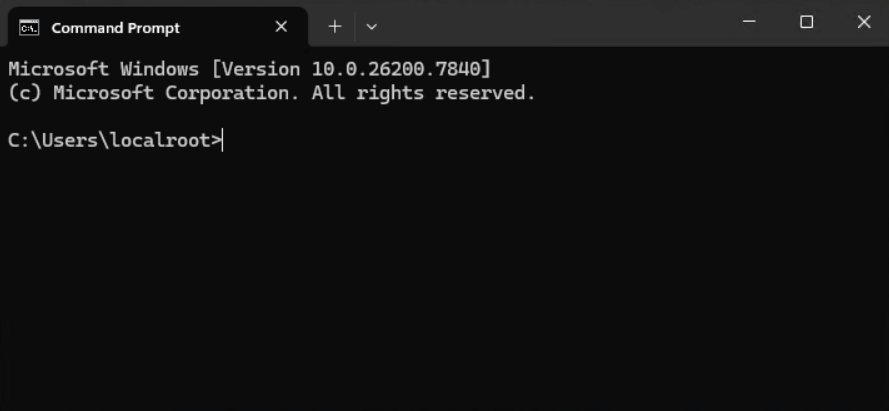

# pitviper

A centralised environment manager for uv.

## Motivation

[uv](https://docs.astral.sh/uv/) is a very fast Python package manager. By default it stores Python environments in a `.venv` folder alongside your project source code, which is not ideal when working on shared network drives or inside a folder synced to cloud storage.

`pitviper` acts as a thin wrapper around `uv` to allow Python environments to be stored locally in a centralised location using the `UV_PROJECT` environment variable. The environments can be activated in a similar way to `conda/mamba`.

## Installation

Install uv:  
`powershell -ExecutionPolicy ByPass -c "irm https://astral.sh/uv/install.ps1 | iex"`

Install pv:  
`curl "https://raw.githubusercontent.com/onewhaleid/pitviper/refs/heads/main/pv.bat" > %USERPROFILE%\.local\bin\pv.bat`

## Usage

Create new environment  
`pv create myenv`

Activate environment  
`pv activate myenv`

Deactivate environment  
`deactivate && set UV_PROJECT=`

Delete environment  
`pv delete myenv`

## Demo

